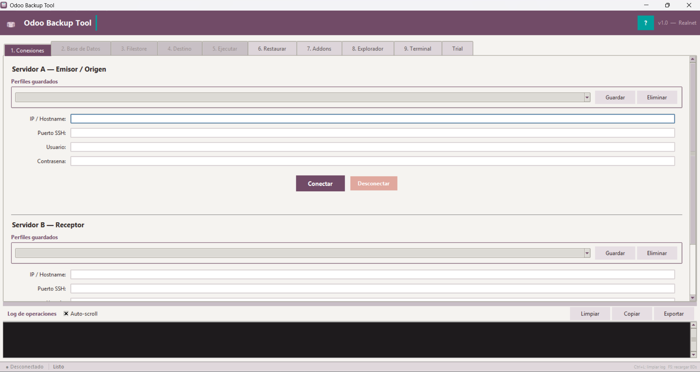

# Odoo Backup Tool

Herramienta de escritorio para **respaldar, restaurar y administrar instancias Odoo** en servidores Linux remotos, sin necesidad de acceso directo al servidor. Opera completamente a través de SSH/SFTP desde una máquina Windows o Linux.


> Referencia

---

## Tabla de contenidos

1. [Requisitos](#1-requisitos)
2. [Instalación y ejecución en modo desarrollo](#2-instalación-y-ejecución-en-modo-desarrollo)
3. [Compilar ejecutable](#3-compilar-ejecutable)
4. [Vista general de la interfaz](#4-vista-general-de-la-interfaz)
5. [Funcionalidades por pestaña](#5-funcionalidades-por-pestaña)
   - [Tab 1 — Conexiones](#tab-1--conexiones)
   - [Tab 2 — Base de datos](#tab-2--base-de-datos)
   - [Tab 3 — Filestore](#tab-3--filestore)
   - [Tab 4 — Destino](#tab-4--destino)
   - [Tab 5 — Ejecutar](#tab-5--ejecutar)
   - [Tab 6 — Restaurar](#tab-6--restaurar)
   - [Tab 7 — Addons](#tab-7--addons)
   - [Tab 8 — Explorador](#tab-8--explorador)
   - [Tab 9 — Terminal](#tab-9--terminal)
   - [Tab Trial](#tab-trial)
6. [Sistema de perfiles de servidor](#6-sistema-de-perfiles-de-servidor)
7. [Log de operaciones](#7-log-de-operaciones)
8. [Inventario de backup](#8-inventario-de-backup)
9. [Íconos del explorador de archivos](#9-íconos-del-explorador-de-archivos)
10. [Lo que la herramienta NO hace](#10-lo-que-la-herramienta-no-hace)
11. [Arquitectura interna](#11-arquitectura-interna)
12. [Dependencias](#12-dependencias)

---

## 1. Requisitos

### Máquina local (donde se ejecuta la herramienta)

| Requisito | Versión mínima |
|---|---|
| Python | 3.10+ |
| tkinter | Incluido en Python estándar (en Linux: `apt install python3-tk`) |
| paramiko | 3.4.0+ |
| Pillow | 10.0.0+ |
| PyInstaller | 6.0.0+ (solo para compilar el ejecutable) |

### Servidores Linux remotos

- Sistema operativo Linux con bash
- Usuario SSH con **sudo sin contraseña** (`NOPASSWD` en `/etc/sudoers`)
- PostgreSQL instalado con usuario `postgres`
- Odoo instalado bajo usuario `odoo` (para `createdb -O odoo`, `chown -R odoo:odoo`)
- Comandos disponibles en el servidor: `pg_dump`, `pg_restore`, `psql`, `zip`, `unzip`
- Para transferencia servidor-a-servidor: `sshpass` en el servidor origen
- Para sincronización de addons: `git` en el servidor destino

---

## 2. Instalación y ejecución en modo desarrollo

```bash
# Clonar o copiar el directorio
cd odoo_backup_tool

# Instalar dependencias
pip install -r requirements.txt

# Ejecutar
python main.py
```

En Linux, si tkinter no está disponible:
```bash
sudo apt install python3-tk
```

---

## 3. Compilar ejecutable

El resultado es un binario único sin dependencias externas (no requiere Python instalado en la máquina destino).

### Windows → `.exe`

```bat
build.bat
```

Salida: `output\dist\OdooBackupTool.exe`

### Linux → ejecutable ELF

```bash
chmod +x build.sh
./build.sh
```

Salida: `output/dist/OdooBackupTool`

> **Nota:** El build incluye automáticamente todos los imports de paramiko, cryptography y Pillow que PyInstaller no detecta por sí solo.

---

## 4. Vista general de la interfaz

La ventana principal se divide en dos zonas:

- **Zona superior** — `ttk.Notebook` con 10 pestañas (Conexiones, BD, Filestore, Destino, Ejecutar, Restaurar, Addons, Explorador, Terminal, Trial)
- **Zona inferior** — Panel de log de operaciones con resaltado de color, botones de exportar y copiar

Las pestañas **2 a 5** (BD, Filestore, Destino, Ejecutar) permanecen visualmente deshabilitadas (gris con texto atenuado) hasta que se establezca la conexión con el Servidor A. Esto indica al usuario que existe una dependencia de conexión antes de proceder.

Al cambiar a las pestañas **Explorador** (8) o **Terminal** (9), la herramienta **auto-conecta** los paneles si ya existe una sesión SSH activa, sin necesidad de clic adicional.

Al seleccionar un perfil en cualquier combobox de perfiles, los datos de conexión se cargan **automáticamente** (sin botón "Cargar").

---

## 5. Funcionalidades por pestaña

---

### Tab 1 — Conexiones

**Propósito:** Establecer las conexiones SSH con los servidores que participarán en el backup o restauración.

**Servidor A — Emisor/Origen:**
- Campos: IP/Hostname, puerto SSH (default: 22), usuario, contraseña
- Panel de perfiles guardados con combobox (carga automática al seleccionar), botones Guardar y Eliminar
- Botones: Conectar / Desconectar
- Indicador de estado de conexión en tiempo real

**Servidor B — Receptor:**
- Idéntico al Servidor A, con su propio conjunto de perfiles y estado
- Es el servidor destino en restauraciones (Tab 6) y el panel derecho en Explorador/Terminal

**Comportamiento al conectar:**
- Habilita automáticamente las pestañas 2–5
- Navega automáticamente a Tab 2 (Base de datos)
- Si el usuario ya estaba en Tab 8 o 9 al momento de conectar, auto-conecta el panel izquierdo del explorador/terminal

**Limitación de autenticación:** Solo soporta usuario + contraseña. No acepta llaves SSH para la conexión de servidores (para Git en Tab 7 sí hay soporte de llaves, ver más adelante).

---

### Tab 2 — Base de datos

**Propósito:** Seleccionar la base de datos PostgreSQL del servidor origen que se va a respaldar.

**Funcionalidades:**
- Lista todas las BDs del servidor automáticamente al conectar (excluye `template0`, `template1`, `postgres`)
- Botón **"Recargar"** para refrescar la lista
- Selección del **formato de dump:**
  - `.dump` — formato binario custom de `pg_dump -Fc` (recomendado): permite restauración paralela con múltiples workers (`pg_restore -j N`)
  - `.sql` — texto plano: compatible con `psql`, más portátil pero mayor tamaño y restauración más lenta
- Botón "Siguiente →" con validación (no avanza si no hay BD seleccionada)

---

### Tab 3 — Filestore

**Propósito:** Identificar el directorio filestore de Odoo en el servidor origen.

**Funcionalidades:**
- Botón **"Buscar en servidor"**: escanea rutas estándar y ejecuta `find` automáticamente para localizar el directorio `filestore`; rutas exploradas:
  - `/var/lib/odoo/.local/share/Odoo/filestore`
  - `/opt/odoo/.local/share/Odoo/filestore`
  - `/home/odoo/.local/share/Odoo/filestore`
  - `/root/.local/share/Odoo/filestore`
  - `/home/odoo18/...` y `/home/odoo19/...`
- Combobox de ruta raíz editable (para rutas no estándar)
- Listado de carpetas disponibles (una por base de datos) con botón "Cargar carpetas"
- Vista de árbol simplificada del contenido del filestore root con tamaños
- Autoselección de la carpeta de BD si el nombre coincide con la BD elegida en Tab 2
- Botón "Siguiente →"

---

### Tab 4 — Destino

**Propósito:** Elegir dónde se guardarán los archivos generados por el backup.

**Opción A — Esta máquina (local):**
- Selector de carpeta con botón "Examinar..."
- Default: `~/Downloads`

**Opción B — Otro servidor remoto:**
- Panel de perfiles de servidor con los mismos campos que Tab 1
- Campo de ruta remota (default: `/opt/backups`)
- La conexión al servidor destino se abre únicamente durante la ejecución del backup usando `sshpass scp` desde el servidor origen hacia el destino; no requiere tener el servidor destino conectado en Tab 1

---

### Tab 5 — Ejecutar

**Propósito:** Ejecutar el backup con todas las opciones configuradas.

**Panel de resumen:** muestra servidor origen, BD + formato, filestore seleccionado y destino del backup antes de iniciar.

**Opciones configurables:**
- Incluir dump de BD (sí/no)
- Incluir filestore (sí/no)
- Limpiar `/tmp/` del servidor al terminar (sí/no)

**Secuencia de ejecución (todo en hilo de fondo):**
1. Recopila inventario del estado actual del servidor (sin detener Odoo)
2. Verifica espacio disponible en `/tmp` del servidor origen
3. Ejecuta `pg_dump` con prioridad reducida (`nice -n 19`)
4. Comprime el filestore con `zip -1 -r` (prioridad reducida)
5. Transfiere el dump y el ZIP al destino:
   - Local: descarga por SFTP con barra de progreso real (bytes/total)
   - Remoto: verifica `sshpass`, espacio, permisos y ejecuta `scp`
6. Limpia archivos temporales en `/tmp` del servidor
7. Guarda el inventario JSON junto al backup

**Barra de progreso** con etiqueta descriptiva de cada paso.

**Botón "Detener":** cancela el proceso en cualquier momento. Envía SIGTERM + SIGKILL al proceso remoto (por PGID) para garantizar limpieza.

**Manejo de conflicto de nombre:** si el archivo ya existe en el destino, muestra un diálogo modal con tres opciones:
- Renombrar automáticamente con timestamp
- Renombrar con nombre personalizado
- Sobreescribir

---

### Tab 6 — Restaurar

**Propósito:** Restaurar una base de datos Odoo (dump + filestore) en un servidor destino.

**Selección del servidor de restauración** (radiobuttons):
- Servidor A — Emisor/Origen
- Servidor B — Receptor
- Servidor de destino del backup (Tab 4, auto-rellena rutas)

**Archivos de entrada:**
- **Dump de BD:** desde archivo local (upload SFTP) o ruta ya existente en el servidor
- **Filestore ZIP:** desde archivo local, ruta en servidor, o "No restaurar filestore"
- **Inventario JSON (opcional):** auto-detectado junto al dump; muestra resumen de host origen, tablas, tamaño, archivos filestore

**Configuración de la BD destino:**
- Nombre de la nueva BD (validado: `[A-Za-z_][A-Za-z0-9_]*`, máx 63 chars)
- Ruta raíz del filestore en el servidor destino

**Opciones avanzadas:**
- Workers para `pg_restore -j N` (1–16, default: 4; solo para formato `.dump`)
- **Neutralizar BD al terminar:** desactiva servidores de correo, crons, fetchmail, proveedores de pago, limpia `report.url` — esencial al restaurar en ambientes de prueba
- Ruta a `odoo.conf` (para la neutralización)
- Eliminar archivos de `/tmp` al terminar

**Secuencia de restauración (hilo de fondo):**
1. Upload de archivos locales (si aplica)
2. `createdb -O odoo {nombre}`
3. Detección automática del formato del dump (`.dump` vs `.sql`)
4. Verificación de compatibilidad de versión PostgreSQL
5. `pg_restore -j N --no-owner --role=odoo` o `psql` según formato
6. Extracción del filestore en staging (misma partición → `mv` atómico)
7. Asignación correcta de permisos (`chown`, `chmod`)
8. Grant de privilegios al usuario `odoo`
9. Neutralización (si activada)
10. Verificación post-restauración con umbrales de comparación vs inventario

**Rollback automático:** si cualquier paso falla, ejecuta `dropdb --if-exists {nombre}` para dejar el servidor limpio.

**Verificación post-restauración:** compara tablas, usuarios, módulos, tamaños de BD y filestore contra el inventario de backup; genera reporte de advertencias o errores en el log.

---

### Tab 7 — Addons

**Propósito:** Sincronizar addons personalizados de Odoo desde un repositorio Git (GitHub/GitLab) en el servidor remoto.

**Configuración:**
- Servidor destino (A o B)
- URL SSH del repositorio (ej: `git@github.com:mi-org/repo.git`)
- Rama (branch, default: `main`)
- Ruta de destino en el servidor (default: `/opt/odoo/addons_custom`)
- Usuario Odoo del sistema operativo (default: `odoo`)
- Tipo: repositorio normal o con submódulos (`git submodule update --remote --recursive`)

**Autenticación SSH para Git — tres modos:**

| Modo | Descripción |
|---|---|
| **Del servidor** | Usa una llave ya existente en `~/.ssh/` del servidor remoto. Escanea y lista las llaves disponibles. No transfiere material de clave |
| **Local** | Usa una llave privada de esta máquina. La descifra en memoria (solicita passphrase si es necesario), la sube temporalmente a `/tmp/.obt_gh_key` y la elimina al terminar |
| **Generar** | Crea un nuevo par Ed25519 en `~/.ssh/`. Muestra la clave pública para registrarla en GitHub/GitLab con botón "Copiar" |

**Opciones adicionales:**
- Reiniciar el servicio Odoo al terminar
- Auto-detección del nombre del servicio (prueba: `odoo`, `odoo18`, `odoo17`, `odoo-server`, etc.)

**Operación:** realiza `git clone` en la primera ejecución y `git pull` en las siguientes. Instala `git` automáticamente si no está disponible en el servidor (apt/yum/apk).

---

### Tab 8 — Explorador

**Propósito:** Explorador de archivos dual estilo FileZilla para navegar y gestionar el filesystem de los servidores remotos.

**Panel izquierdo:** Servidor A (origen)  
**Panel derecho:** Servidor B o servidor destino del backup

Ambos paneles se auto-conectan al entrar a esta pestaña si hay sesiones SSH activas.

**Columnas del árbol:**

| Columna | Descripción |
|---|---|
| Nombre | Con ícono de tipo de archivo (ver sección de íconos) |
| Tamaño | Bytes humanizados para archivos |
| Modificado | Fecha y hora de la última modificación |
| Permisos | Notación rwx estilo `stat.filemode()` |
| Propietario | Usuario del sistema operativo |

**Navegación:**
- Botones ◀ / ▶ (historial de navegación)
- Botón ▲ (subir un nivel)
- Botón ⌂ (home — directorio del usuario SSH)
- Botón ↺ / F5 (refrescar)
- **Breadcrumbs clickeables** — cada segmento de la ruta es un botón; al hacer clic en la barra de ruta se convierte en campo de entrada directa
- Checkbox **"Mostrar ocultos"** para archivos que comienzan con `.`
- **Ordenación por columna** — clic en cabecera, toggle asc/desc; directorios siempre primero

**Atajos de teclado:**

| Tecla | Acción |
|---|---|
| F2 | Renombrar |
| F5 | Refrescar |
| Delete | Eliminar |
| Backspace | Subir un nivel |
| Enter | Entrar al directorio |
| Alt + ← | Atrás |
| Alt + → | Adelante |

**Menú contextual (botón derecho):**
- Abrir / Entrar (directorios)
- Copiar al otro panel →  /  ← Copiar al otro panel
- Mover al otro panel →  /  ← Mover al otro panel
- Descargar archivo...
- Descargar carpeta como .zip... (comprime en servidor, descarga, elimina ZIP temporal)
- Descargar N elemento(s)... (multi-selección)
- Nueva carpeta (`mkdir -p`)
- Renombrar (`mv`)
- Eliminar (con confirmación; `rm -f` archivos, `rm -rf` directorios)
- Permisos (chmod) — ingresa el modo en formato numérico, ej: `755`
- Propiedades — tipo, tamaño, fecha, permisos octales, owner, group, symlink target
- Copiar nombre al portapapeles
- Actualizar F5

**Multi-selección:** Shift+clic / Ctrl+clic para seleccionar múltiples elementos.

---

### Tab 9 — Terminal

**Propósito:** Terminal SSH interactiva embebida (PTY real) en formato dual panel.

**Panel izquierdo:** Servidor origen (A)  
**Panel derecho:** Servidor B o servidor destino del backup

Ambas terminales se auto-conectan al entrar a esta pestaña si hay sesiones SSH activas.

**Características:**
- PTY real: `xterm-256color`, 220 columnas × 50 filas
- El estado del shell persiste (variables de entorno, `cd`, etc.) dentro de la sesión
- Buffer de 5000 líneas (auto-recorta el más antiguo)
- Historial de comandos navegable con ↑ / ↓ (no guarda duplicados consecutivos)
- Resaltado de keywords en el output: **INFO** (azul), **WARNING** (amarillo), **ERROR** (rojo)
- Tema oscuro: fondo `#0D1117`, texto `#C9D1D9`, fuente Consolas 10
- Botón **"Ctrl+C"** — envía señal de interrupción (`\x03`) al proceso remoto
- Botón **"Limpiar"** — limpia el buffer de texto visible
- Botones **"Reconectar"** y **"Desconectar"** en el encabezado de cada panel

---

### Tab Trial

**Propósito:** Actualizar los parámetros de licencia de prueba (`database.*`) en `ir_config_parameter` de una base de datos Odoo para extender o renovar el período de trial.

> **Advertencia:** Esta operación modifica directamente la tabla `ir_config_parameter`. No tiene undo automático.

**Paso 1 — Obtener valores frescos** (dos opciones):

- **Generar valores frescos:** Genera localmente un `uuid4` para `database.secret` y `database.uuid`, y la fecha actual para `database.create_date`. No requiere conexión al servidor.
- **Crear BD Odoo limpia:** Crea una BD temporal (`obt_trial_tmp`), inicializa Odoo con `--stop-after-init`, y extrae los parámetros `database.*` generados por Odoo. Tarda 2–5 minutos. Incluye botón para **eliminar la BD temporal** al terminar.

Los valores obtenidos se muestran en una tabla (clave, valor, create_date, write_date).

**Paso 2 — Seleccionar BD objetivo:**
- Lista las BDs disponibles en el servidor con un clic
- Botón **"Consultar BD objetivo"**: muestra los valores `database.*` actuales de la BD seleccionada
- Botón **"Aplicar valores Trial"** (con confirmación): ejecuta los `UPDATE` en `database.secret`, `database.uuid`, `database.create_date`, y elimina `database.expiration_date` y `database.expiration_reason`

---

## 6. Sistema de perfiles de servidor

Los perfiles se almacenan en `~/.odoo_backup_tool/servers.json` y se comparten entre los tres selectores de servidor de la aplicación (Servidor A, Servidor B y Servidor destino).

```json
[
  {
    "name": "Produccion cliente",
    "host": "192.168.1.10",
    "port": 22,
    "user": "root",
    "password": "mi_contraseña"
  }
]
```

> **Seguridad:** Las contraseñas se almacenan en **texto plano**. Este archivo debe protegerse con permisos restrictivos en el sistema operativo y nunca subirse a control de versiones.

**Seleccionar un perfil** en el combobox carga los datos automáticamente sin necesidad de clic adicional.

**Guardar perfil:** solicita un nombre único mediante un diálogo. Si el nombre ya existe, sobreescribe el existente.

**Eliminar perfil:** requiere confirmación.

---

## 7. Log de operaciones

El panel de log (zona inferior de la ventana) registra todas las operaciones con marcas de tiempo.

**Herramientas del log:**
- Checkbox **"Auto-scroll"** — mantiene la vista al final del log durante operaciones largas
- Botón **"Limpiar"** (atajo: Ctrl+L)
- Botón **"Copiar"** — copia todo el contenido al portapapeles
- Botón **"Exportar"** — guarda el log como `.txt` con nombre con timestamp

**Color-coding por nivel:**

| Color | Tipo de mensaje |
|---|---|
| Rojo | `[ERROR]` — fallos y rollbacks |
| Verde | Completado exitosamente |
| Naranja | `[aviso]` — advertencias, incompatibilidades |
| Azul | Procesos en curso (`[pg_dump en curso]`, etc.) |
| Blanco suavizado | Mensajes informativos generales |
| Gris | Marca de tiempo `[HH:MM:SS]` |

**Resaltado de palabras clave:** dentro de cualquier línea, las palabras `INFO`, `WARNING`, `WARN` y `ERROR` se resaltan en negrita con colores adicionales.

**Barra de estado** (parte inferior de la ventana):
- Indicador de conexión: `● Desconectado` (gris) / `● host:puerto` (verde)
- Estado de operación: Listo, En curso..., ✓ Completado, ✗ Error, ⚠ Verificacion fallida
- Recordatorio de atajos: `Ctrl+L: limpiar log   F5: recargar BDs`

---

## 8. Inventario de backup

Durante cada backup se genera automáticamente un archivo JSON con el estado del servidor origen. Este inventario se usa después en Tab 6 para verificar que la restauración fue completa y correcta.

**Datos que captura:**
- Versión de PostgreSQL, tamaño de la BD, número de tablas
- Usuarios activos, módulos instalados con estado `installed`
- Conteo de `ir_attachment` con y sin filestore
- Conteo de filas en tablas clave: `res_users`, `res_company`, `res_partner`, `account_move`, `sale_order`, `hr_employee`, `product_template`, entre otras
- Estadísticas del filestore: total de archivos, directorios, tamaño, archivos de 0 bytes

**Ubicación:**
- Backup local → `{directorio_destino}/{nombre_dump}_inventory.json`
- Backup remoto → `~/.odoo_backup_tool/inventories/{nombre_dump}_inventory.json`

**Auto-detección en restauración:** al seleccionar el dump en Tab 6, la herramienta busca automáticamente el JSON compañero para cargar el resumen del inventario.

**Umbrales de verificación post-restauración:**

| Métrica | Error (< X%) | Advertencia (< X%) |
|---|---|---|
| Número de tablas | 80% | 95% |
| Módulos instalados | 80% | 95% |
| Tamaño de BD | 50% | 70% |
| Archivos en filestore | 50% | 90% |
| Tamaño del filestore | 60% | 80% |
| Filas por tabla clave | — | 80% |

---

## 9. Íconos del explorador de archivos

Los íconos del Tab 8 (Explorador) son imágenes RGBA 16×16 generadas programáticamente con Pillow — no dependen de archivos externos. Se cachean en memoria durante la sesión.

| Ícono | Apariencia | Condición de uso |
|---|---|---|
| `folder` | Carpeta ámbar/dorada con tab | Directorio |
| `folder_link` | Carpeta ámbar + flecha cian | Symlink a directorio |
| `file` | Página gris con esquina doblada | Archivo genérico |
| `file_link` | Página + flecha cian | Symlink a archivo |
| `file_exec` | Página verde con barra verde | Archivo con bit ejecutable (`x` en permisos) |
| `file_image` | Página azul con paisaje (sol + colinas) | `.png .jpg .jpeg .gif .bmp .svg .webp .ico .tiff` |
| `file_archive` | Caja naranja con tapa y correa | `.zip .tar .gz .bz2 .xz .7z .rar .tgz .deb .rpm` |
| `file_config` | Página morada con líneas de config | `.conf .ini .yaml .yml .toml .json .xml .env .cfg` |
| `file_python` | Página azul con hint del logo Python | `.py .pyc .pyo` |
| `file_log` | Página con líneas de colores (gris/naranja/rojo) | `.log` |
| `file_shell` | Página verde con flecha `>` | `.sh .bash .zsh` |

---

## 10. Lo que la herramienta NO hace

Es importante conocer las limitaciones para no asumir capacidades que la herramienta no tiene:

| Limitación | Detalle |
|---|---|
| **No programa backups automáticos** | No hay scheduler ni cron interno. Los backups deben iniciarse manualmente |
| **No soporta servidores Windows** | Todos los comandos remotos asumen Linux/bash, sudo, systemctl, apt/yum |
| **No cifra las contraseñas almacenadas** | `servers.json` guarda contraseñas en texto plano |
| **No soporta llave SSH para conexión de servidores** | Solo usuario + contraseña para A, B y destino. Las llaves SSH son solo para Git (Tab 7) |
| **No detiene Odoo antes del backup** | Opera con Odoo corriendo; `pg_dump` es consistente, pero cambios durante el dump pueden quedar fuera del backup |
| **No hace backup incremental** | Siempre dump completo + ZIP completo del filestore |
| **No hace backup de múltiples BDs simultáneamente** | Se respalda una BD por ejecución |
| **No muestra tamaño de directorios en el explorador** | El Explorador (Tab 8) no calcula el tamaño de carpetas automáticamente |
| **No permite subir archivos por drag-and-drop** | La transferencia local→servidor no está implementada vía drag-and-drop |
| **No soporta restauración de dumps cifrados** | Solo dumps generados por la herramienta o con `pg_dump` estándar |
| **No modifica `odoo.conf`** | La neutralización desactiva parámetros en la BD, pero no redirige la instancia Odoo a la nueva BD |
| **No hace backup de la configuración de Odoo** | No respalda `odoo.conf`, módulos instalados de Enterprise, ni certificados DIAN |
| **No renderiza colores ANSI en la terminal** | Las secuencias de escape ANSI son filtradas; el output aparece en texto plano sin colores |
| **No guarda historial de terminal entre sesiones** | El historial de comandos se pierde al cerrar la herramienta |
| **Tab Trial no tiene undo** | Modificar `database.*` no se puede revertir automáticamente |
| **No soporta autenticación HTTPS para Git** | Solo SSH con llaves para sincronización de addons (Tab 7) |
| **No gestiona múltiples repositorios** | Tab 7 sincroniza un solo repositorio Git por operación |

---

## 11. Arquitectura interna

```
odoo_backup_tool/
├── main.py                       # Punto de entrada — crea ventana y lanza BackupApp
├── gui/
│   ├── app.py                    # BackupApp: controlador principal (~4400 líneas)
│   ├── file_browser_panel.py     # FileBrowserPanel: panel explorador individual
│   ├── ssh_terminal_panel.py     # SSHTerminalPanel: terminal PTY individual
│   ├── icons.py                  # Generador de íconos con Pillow (sin archivos externos)
│   └── help_window.py            # Ventana de ayuda contextual
└── core/
    ├── ssh_client.py             # Wrapper paramiko: SSH, SFTP, ejecución remota
    ├── profiles.py               # Perfiles de servidor (lectura/escritura de servers.json)
    ├── db_manager.py             # pg_dump en servidor remoto
    ├── filestore_manager.py      # Descubrimiento y compresión del filestore
    ├── transfer.py               # Transferencia SFTP local y server-to-server (sshpass scp)
    ├── restore_manager.py        # Restauración completa BD + filestore + neutralización
    ├── addons_manager.py         # Clone/pull desde Git con autenticación por llave
    ├── inventory_manager.py      # Captura de métricas del sistema (snapshot JSON)
    ├── trial_manager.py          # Actualización de parámetros database.* en Odoo
    └── file_browser.py           # Listado de filesystem remoto vía SFTP (stat, chmod, mv, rm)
```

**Patrón de comunicación GUI ↔ Hilo de fondo:**

Todas las operaciones de red corren en hilos `daemon=True`. La GUI nunca se modifica directamente desde hilos secundarios. El controlador (`app.py`) mantiene una `queue.Queue` y la vacía cada 100 ms mediante `_poll_queue()`, que actualiza widgets según el tipo de mensaje recibido.

**Tres conexiones SSH independientes:**

| Variable | Rol |
|---|---|
| `self._ssh` | Servidor A — usado en Tabs 2, 3, 5 y panel izquierdo de 8/9 |
| `self._ssh_restore` | Servidor B — usado en Tab 6 (restaurar) y panel derecho de 8/9 |
| `self._ssh_dest` | Servidor destino del backup — Tab 4 remoto; panel derecho de 8/9 como fallback |

---

## 12. Dependencias

```
paramiko>=3.4.0
Pillow>=10.0.0
pyinstaller>=6.0.0
```

Instalar con:
```bash
pip install -r requirements.txt
```

| Paquete | Uso |
|---|---|
| `paramiko` | SSH, SFTP, PTY interactivo, generación y carga de llaves Ed25519/RSA/ECDSA |
| `Pillow` | Generación de íconos 16×16 en el explorador de archivos |
| `pyinstaller` | Solo para compilar el ejecutable distribuible |

**Dependencias estándar de Python** (sin instalación adicional): `tkinter`, `threading`, `queue`, `json`, `os`, `datetime`, `re`, `uuid`, `socket`, `io`, `stat`, `posixpath`

---

## Configuración persistente

| Archivo | Contenido |
|---|---|
| `~/.odoo_backup_tool/servers.json` | Perfiles de servidor guardados |
| `~/.odoo_backup_tool/settings.json` | Geometría de ventana y posición del divisor del log |
| `~/.odoo_backup_tool/inventories/` | Inventarios JSON de backups con destino remoto |
| `~/.ssh/{nombre_llave}` | Llaves Ed25519 generadas desde Tab 7 (modo 0600) |

---

*Odoo Backup Tool — Realnet S.A.S.*
